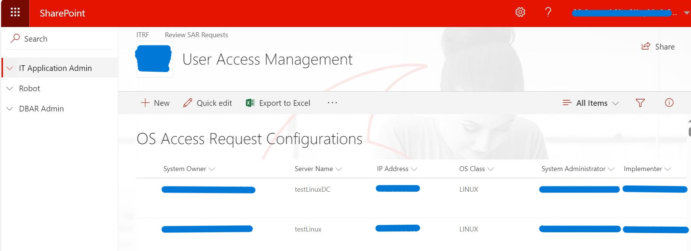
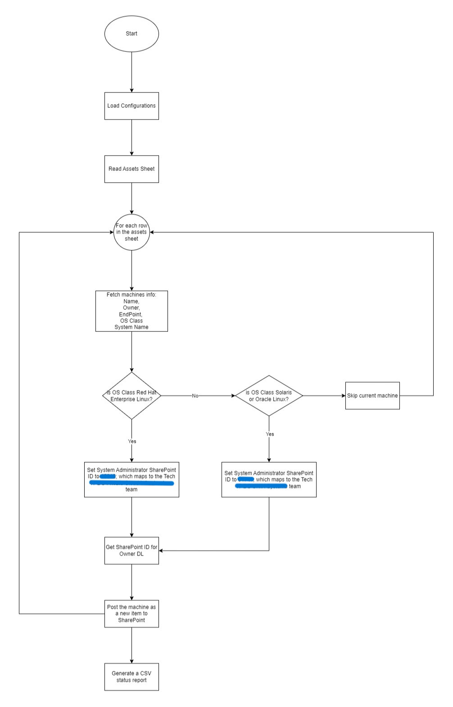

[![LinkedIn][linkedin-shield]][linkedin-url]

<!-- PROJECT LOGO -->
 

  
  <h3 align="center">Asset Sheet ETL for OS User Management</h3>

<!-- TABLE OF CONTENTS -->

  
Table of Contents

  <ol>
    <li>
      <a href="#about-the-project">About The Project</a>
      <ul>
        <li><a href="#business-case">Business Case</a></li>
        <li><a href="#technical-solution">Technical Solution</a></li>
        <li><a href="#flowchart">Flowchart</a></li>
        <li><a href="#tech-stack">Tech Stack</a></li>
      </ul>
    </li>
    <li><a href="#contact">Contact</a></li>
  </ol>

<!-- ABOUT THE PROJECT -->
## About The Project

* **Project Name:** Asset Sheet ETL for OS User Management  
* **Version:** v1.0.0  
* **Department:** Technology

---

### Business Case

This project serves as an extension to the **Automated User Management with Ansible** project. It automates the process of loading the **Assets Sheet** into a configuration SharePoint list, containing details of all machines in the company, their team owners, and their OS types. 

When a user submits a request to access a new machine, the system fetches the available machines from this configuration list. This automation reduces the manual effort required to manage machine assets and ensures that the most up-to-date information is available for user requests.

(<a href="#readme-top">back to top</a>)

### Technical Solution

I developed an ETL process to extract machine asset data from an Excel sheet, fetch the corresponding owner information from Active Directory, and load the data into the configuration SharePoint list. This ensures seamless integration with the **Automated User Management with Ansible** project, making asset management more efficient and scalable.

(<a href="#readme-top">back to top</a>)

### Flowchart

(<a href="#readme-top">back to top</a>)

### Tech Stack

This project was developed using the following tech stack:

* **Python**
* **Ansible**

(<a href="#readme-top">back to top</a>)

<!-- CONTACT -->
## Contact

Mohamed AbdelGawad Ibrahim - [@m-abdelgawad](https://www.linkedin.com/in/m-abdelgawad/) - <a href="tel:+201069052620">+201069052620</a>

(<a href="#readme-top">back to top</a>)

<!-- MARKDOWN LINKS & IMAGES -->
[linkedin-shield]: https://img.shields.io/badge/-LinkedIn-black.svg?style=for-the-badge&logo=linkedin&colorB=555
[linkedin-url]: https://www.linkedin.com/in/m-abdelgawad/
